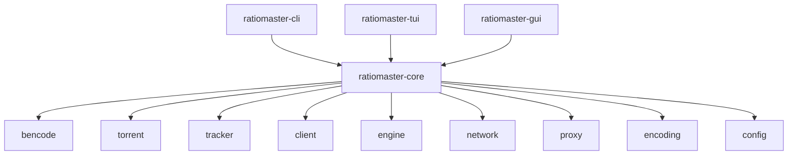

# ratiomaster.rs

[](https://github.com/xbattlax/ratiomaster-rs/actions/workflows/ci.yml)
[](LICENSE)
[](#msrv)

A modern reimplementation of [RatioMaster.NET](http://ratiomaster.net) in Rust — the classic BitTorrent tracker communication tool, rebuilt from scratch for performance, safety, and cross-platform support.

RatioMaster.NET was the go-to tool for emulating BitTorrent clients when communicating with trackers. This project brings the same functionality to 2026 with a native Rust core, three interface options (CLI, TUI, GUI), and prebuilt binaries for Linux, macOS, and Windows.

## What's New in v1.1.0

- **TrackerClient trait** — pluggable HTTP transport layer for testability and custom backends
- **Keyring support** — optional system credential storage via macOS Keychain, Windows Credential Manager, or Linux Secret Service (`--features keyring`)
- **Property-based tests** — proptest suite for BEncode roundtrips, URL encoding, speed simulation, and peer ID generation
- **Security hardening** — credential masking in Debug output, TCP listener bound to 127.0.0.1, 10 MB response cap, `#[non_exhaustive]` enums, audited `base64` crate
- **Fuzz testing** — libFuzzer targets for BEncode decoding and torrent parsing
- **Criterion benchmarks** — micro-benchmarks for BEncode, URL encoding, torrent parsing, speed simulation, and key generation
- **MSRV enforcement** — `rust-version = "1.88"` in all crates, CI-verified
- **365+ tests** — unit, integration, doc tests, and property-based tests

See [CHANGELOG.md](CHANGELOG.md) for the full history.

## Why Rust?

The original RatioMaster.NET was written in C# and limited to Windows. This reimplementation offers:

- **Cross-platform** — runs natively on Linux, macOS (including Apple Silicon), and Windows
- **No runtime dependency** — single static binary, no .NET Framework required
- **Memory safe** — no buffer overflows, no null pointer crashes
- **Fast** — zero-cost abstractions, minimal overhead
- **Modern architecture** — workspace with shared core library and three frontends

## Features

- **41 client profiles** across 16 families: uTorrent, BitComet, Vuze, Azureus, BitTorrent, Transmission, Deluge, ABC, BitLord, BTuga, BitTornado, Burst, BitTyrant, BitSpirit, KTorrent, Gnome BT
- **TrackerClient trait** — pluggable HTTP transport with default `HttpTrackerClient` and mock support for testing
- **Three interfaces**: command-line (CLI), terminal UI (TUI), and native desktop GUI (egui)
- **Proxy support**: SOCKS4, SOCKS4a, SOCKS5, HTTP CONNECT with authentication
- **HTTP and HTTPS**: raw HTTP/1.0 and HTTP/1.1 with TLS support (tokio-rustls) for modern trackers
- **Custom headers**: exact header control per client profile for accurate emulation
- **Compression**: gzip decompression and chunked transfer encoding
- **Scrape support**: tracker scrape requests for seeder/leecher stats
- **Batch mode**: process multiple torrents simultaneously
- **TCP listener**: respond to incoming BitTorrent handshakes
- **Speed simulation**: configurable upload/download speeds with randomization
- **Stop conditions**: stop after upload/download amount, time, or ratio
- **Session persistence**: save and resume sessions
- **Keyring integration**: optional system credential storage (feature-gated)
- **365+ tests** across unit, integration, doc tests, and property-based tests

## Installation

### From releases

Download pre-built binaries from the [Releases](https://github.com/xbattlax/ratiomaster-rs/releases) page.

Available targets:
- Linux x86_64 (musl static)
- Linux aarch64 (musl static)
- macOS x86_64
- macOS aarch64 (Apple Silicon) — signed with Developer ID
- Windows x86_64

### From source

```sh
git clone https://github.com/xbattlax/ratiomaster-rs.git
cd ratiomaster-rs
cargo build --release
```

Binaries will be in `target/release/ratiomaster-cli`, `target/release/ratiomaster-tui`, and `target/release/ratiomaster-gui`.

Requires Rust 1.88 or later (see [MSRV](#msrv)).

## Quick Start

### CLI

```sh
# Basic usage with default client (uTorrent 3.3.2)
ratiomaster-cli my_torrent.torrent

# Specify client and upload speed
ratiomaster-cli my_torrent.torrent --client "BitComet 1.20" --upload 200

# With SOCKS5 proxy
ratiomaster-cli my_torrent.torrent --proxy-type socks5 --proxy-host 127.0.0.1 --proxy-port 1080

# Stop after uploading 1 GB
ratiomaster-cli my_torrent.torrent --stop-upload 1073741824

# Batch mode — process all torrents in a directory
ratiomaster-cli batch /path/to/torrents/
```

### TUI

```sh
# Launch interactive terminal UI
ratiomaster-tui

# Launch with a torrent pre-loaded
ratiomaster-tui my_torrent.torrent
```

The TUI provides a multi-tab interface with file browser, real-time stats, and keyboard navigation.

### GUI

```sh
# Launch native desktop GUI
ratiomaster-gui
```

The GUI provides a modern desktop application with:
- Multi-tab interface for managing multiple torrents
- Native file dialogs for opening torrents and saving logs
- 41-client dropdown with all supported profiles
- Real-time speed and ratio display
- Proxy configuration (SOCKS4/4a/5, HTTP Connect)
- Stop conditions with configurable values
- Scrollable log viewer with filtering
- Dark/light theme toggle

**Keyboard shortcuts:**
| Shortcut | Action |
|----------|--------|
| `Ctrl+O` | Open torrent file |
| `Ctrl+N` | New tab |
| `Ctrl+W` | Close tab |
| `Ctrl+Q` | Quit |

### TUI Keybindings

| Key | Action |
|-----|--------|
| `o` | Open file browser |
| `Enter` | Select torrent / start engine |
| `s` | Stop engine |
| `f` | Force announce |
| `Tab` / `Shift+Tab` | Switch tabs |
| `n` | New tab |
| `w` | Close tab |
| `l` | Toggle log filter |
| `q` | Quit |

## CLI Reference

```
ratiomaster-cli [OPTIONS] <TORRENT_FILE>
ratiomaster-cli batch [OPTIONS] <PATHS>...
```

### Options

| Option | Description | Default |
|--------|-------------|---------|
| `<TORRENT_FILE>` | Path to .torrent file | Required |
| `-c, --client <NAME>` | Client profile to emulate | `uTorrent 3.3.2` |
| `-u, --upload <KB/s>` | Upload speed in KB/s | `100` |
| `-d, --download <KB/s>` | Download speed in KB/s | `0` |
| `-t, --tracker <URL>` | Override tracker URL | From torrent |
| `-p, --port <PORT>` | Listening port | `6881` |
| `-i, --interval <SECS>` | Override announce interval | From tracker |
| `-s, --downloaded <BYTES>` | Initial bytes already downloaded | `0` |
| `--upload-random <MIN:MAX>` | Random upload range in KB/s | Disabled |
| `--download-random <MIN:MAX>` | Random download range in KB/s | Disabled |
| `--stop-upload <BYTES>` | Stop after uploading N bytes | Never |
| `--stop-download <BYTES>` | Stop after downloading N bytes | Never |
| `--stop-time <SECS>` | Stop after N seconds | Never |
| `--stop-ratio <RATIO>` | Stop after reaching ratio | Never |
| `--proxy-type <TYPE>` | Proxy type: socks4, socks4a, socks5, http | None |
| `--proxy-host <HOST>` | Proxy hostname | - |
| `--proxy-port <PORT>` | Proxy port | - |
| `--proxy-user <USER>` | Proxy username | - |
| `--proxy-pass <PASS>` | Proxy password | - |
| `--tcp-listener` | Enable TCP handshake listener | Disabled |
| `--scrape` | Enable scrape requests | Disabled |
| `--ignore-failure` | Ignore tracker failure reasons | Disabled |
| `--custom-peer-id <ID>` | Custom peer ID string | Generated |
| `--custom-key <KEY>` | Custom tracker key | Generated |
| `--config <PATH>` | Load config from TOML file | Default |
| `--log-file <PATH>` | Write logs to file | Stderr |
| `--verbose` | Verbose logging | Disabled |
| `--quiet` | Suppress output (errors only) | Disabled |
| `--list-clients` | List all client profiles | - |

## Configuration

Configuration file location: `~/.config/ratiomaster/config.toml`

```toml
[general]
default_client = "uTorrent 3.3.2"
port = 6881
ignore_failure_reason = false

[upload]
speed = 100           # KB/s
random_enabled = false
random_min = 50       # KB/s
random_max = 150      # KB/s

[download]
speed = 0             # KB/s
random_enabled = false
random_min = 0        # KB/s
random_max = 0        # KB/s

[stop]
condition = "never"   # never, upload, download, time, ratio
value = 0

[proxy]
enabled = false
type = "socks5"       # socks4, socks4a, socks5, http
host = "127.0.0.1"
port = 1080
username = ""
password = ""
```

## Supported Client Profiles

All 41 profiles from the original RatioMaster.NET are supported, with accurate peer ID format, key generation, and HTTP header emulation for each:

| # | Name | Family |
|---|------|--------|
| 1 | uTorrent 3.3.2 | uTorrent |
| 2 | uTorrent 3.3.0 | uTorrent |
| 3 | uTorrent 3.2.0 | uTorrent |
| 4 | uTorrent 2.0.1(19078) | uTorrent |
| 5 | uTorrent 1.8.5(17414) | uTorrent |
| 6 | uTorrent 1.8.1-beta(11903) | uTorrent |
| 7 | uTorrent 1.8.0 | uTorrent |
| 8 | uTorrent 1.7.7 | uTorrent |
| 9 | uTorrent 1.7.6 | uTorrent |
| 10 | uTorrent 1.7.5 | uTorrent |
| 11 | uTorrent 1.6.1 | uTorrent |
| 12 | uTorrent 1.6 | uTorrent |
| 13 | BitComet 1.20 | BitComet |
| 14 | BitComet 1.03 | BitComet |
| 15 | BitComet 0.98 | BitComet |
| 16 | BitComet 0.96 | BitComet |
| 17 | BitComet 0.93 | BitComet |
| 18 | BitComet 0.92 | BitComet |
| 19 | Vuze 4.2.0.8 | Vuze |
| 20 | Azureus 3.1.1.0 | Azureus |
| 21 | Azureus 3.0.5.0 | Azureus |
| 22 | Azureus 3.0.4.2 | Azureus |
| 23 | Azureus 3.0.3.4 | Azureus |
| 24 | Azureus 3.0.2.2 | Azureus |
| 25 | Azureus 2.5.0.4 | Azureus |
| 26 | BitTorrent 6.0.3(8642) | BitTorrent |
| 27 | Transmission 2.82(14160) | Transmission |
| 28 | Transmission 2.92(14714) | Transmission |
| 29 | Deluge 1.2.0 | Deluge |
| 30 | Deluge 0.5.8.7 | Deluge |
| 31 | Deluge 0.5.8.6 | Deluge |
| 32 | BitLord 1.1 | BitLord |
| 33 | ABC 3.1 | ABC |
| 34 | BTuga 2.1.8 | BTuga |
| 35 | BitTornado 0.3.17 | BitTornado |
| 36 | Burst 3.1.0b | Burst |
| 37 | BitTyrant 1.1 | BitTyrant |
| 38 | BitSpirit 3.6.0.200 | BitSpirit |
| 39 | BitSpirit 3.1.0.077 | BitSpirit |
| 40 | KTorrent 2.2.1 | KTorrent |
| 41 | Gnome BT 0.0.28-1 | Gnome BT |

## Architecture



```
ratiomaster-rs/
├── crates/
│   ├── ratiomaster-core/     # Core library (shared by all frontends)
│   │   ├── bencode/          # BEncode codec (encoder/decoder)
│   │   ├── torrent/          # .torrent file parser
│   │   ├── tracker/          # TrackerClient trait, announce URL builder, response parser, scrape
│   │   ├── client/           # 41 client profiles, peer ID / key generation
│   │   ├── engine/           # Async announce engine, speed simulation, stop conditions
│   │   ├── network/          # Raw HTTP/1.0-1.1 client with TLS, TCP listener, local IP
│   │   ├── proxy/            # SOCKS4/4a/5, HTTP CONNECT implementations
│   │   ├── encoding/         # URL encoding (per-client quirks)
│   │   └── config/           # App config, session persistence, custom profiles, keyring
│   ├── ratiomaster-cli/      # Command-line interface (clap)
│   ├── ratiomaster-tui/      # Terminal UI (ratatui + crossterm)
│   └── ratiomaster-gui/      # Native desktop GUI (egui/eframe)
├── fuzz/                     # libFuzzer fuzz targets
├── tests/                    # Integration tests + fixtures
└── .github/workflows/        # CI (build + test + MSRV) and Release (5-target cross-build)
```

## Security

See [SECURITY.md](SECURITY.md) for:
- Vulnerability reporting procedures
- Code signing and notarization verification (macOS)
- Build verification via SHA-256 checksums
- Security improvements in recent versions

## Benchmarks

Criterion micro-benchmarks are in `crates/ratiomaster-core/benches/`:

| Benchmark | What it measures |
|-----------|-----------------|
| `bencode_bench` | BEncode encode/decode/roundtrip at small/medium/large sizes |
| `url_encode_bench` | URL encoding of info hashes and random data, uppercase vs lowercase |
| `torrent_bench` | Parsing a realistic ~700 MB torrent file fixture |
| `speed_bench` | Speed initialization, variation (1000 iterations), bytes-for-interval |
| `generator_bench` | Peer ID and session key generation across different formats |

```sh
# Run all benchmarks
cargo bench -p ratiomaster-core

# Run a specific benchmark
cargo bench -p ratiomaster-core --bench bencode_bench
```

### Sample Results (Apple M2 Ultra, Rust 1.93)

| Benchmark | Time |
|-----------|------|
| bencode decode small (50B) | ~150 ns |
| bencode roundtrip medium (1KB) | ~758 ns |
| bencode roundtrip large (100KB) | ~13.5 us |
| url_encode 20B info_hash | ~48 ns |
| url_encode 100B random | ~192 ns |
| torrent parse realistic | ~62 us |
| init_speed | ~22 ns |
| vary_speed x1000 | ~21 us |
| generate_peer_id | ~75 ns |
| generate_key (hex) | ~44 ns |

Benchmarks run automatically in CI on every push to `main`, with Criterion HTML reports uploaded as artifacts.

## Fuzzing

Fuzz targets live in `fuzz/fuzz_targets/` and require nightly Rust:

```sh
cargo install cargo-fuzz
cd fuzz
cargo +nightly fuzz run bencode_decode -- -max_total_time=300
cargo +nightly fuzz run torrent_parse -- -max_total_time=300
```

CI runs both targets for 60 seconds on every push to `main`.

## MSRV

The minimum supported Rust version is **1.88**. This is enforced via `rust-version` in all `Cargo.toml` files and verified in CI.

## Development

### Building

```sh
# Debug build
cargo build

# Release build (all frontends)
cargo build --release

# Build specific frontend
cargo build --release -p ratiomaster-cli
cargo build --release -p ratiomaster-tui
cargo build --release -p ratiomaster-gui

# Build with keyring support
cargo build --release -p ratiomaster-cli --features keyring
```

### Testing

```sh
# Run all tests
cargo test --workspace

# Run with verbose output
cargo test --workspace -- --nocapture

# Run property-based tests
cargo test -p ratiomaster-core --test proptest_suite
```

### Benchmarking

```sh
cargo bench -p ratiomaster-core
```

### Fuzzing

```sh
cd fuzz && cargo +nightly fuzz run bencode_decode
```

### Linting

```sh
cargo clippy --workspace --all-targets -- -D warnings
cargo fmt --all -- --check
cargo doc --no-deps  # check for rustdoc warnings
```

### MSRV check

```sh
rustup install 1.88
cargo +1.88 check --workspace
```

## Comparison with RatioMaster.NET

| Feature | RatioMaster.NET | ratiomaster.rs |
|---------|----------------|-----------------|
| Language | C# (.NET) | Rust |
| Platform | Windows only | Linux, macOS, Windows |
| Runtime | .NET Framework | None (static binary) |
| Interface | Windows Forms GUI | CLI + TUI + native GUI |
| Client profiles | ~40 | 41 |
| HTTPS/TLS | No | Yes (tokio-rustls) |
| Proxy support | SOCKS4/5, HTTP | SOCKS4/4a/5, HTTP CONNECT |
| Batch mode | No | Yes |
| Configuration | Registry | TOML file |
| Tests | None | 365+ (unit, integration, property, doc) |
| Benchmarks | None | Criterion micro-benchmarks |
| Fuzzing | None | libFuzzer (2 targets) |
| Binary size | ~2 MB + .NET | ~7 MB standalone |
| Async engine | No | Yes (tokio) |

## Contributing

1. Fork the repository
2. Create a feature branch (`git checkout -b feature/my-feature`)
3. Make your changes
4. Run tests (`cargo test --workspace`) and linting (`cargo clippy -- -D warnings`)
5. Format code (`cargo fmt`)
6. Commit and push
7. Open a pull request

## Credits

Inspired by [RatioMaster.NET](http://ratiomaster.net) — the original BitTorrent tracker emulation tool that served the community for years. This project is a clean-room reimplementation; no code from the original was used.

## License

MIT License - see [LICENSE](LICENSE) for details.
